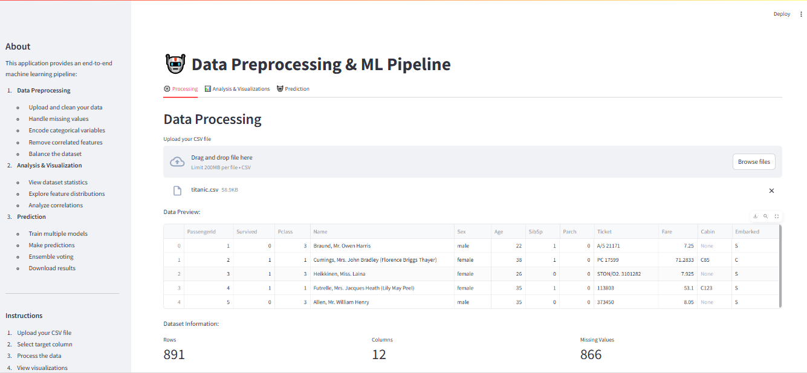
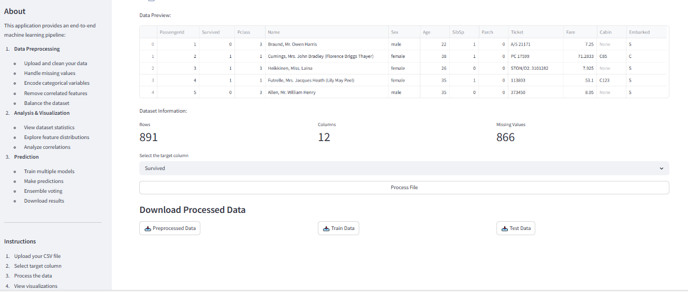
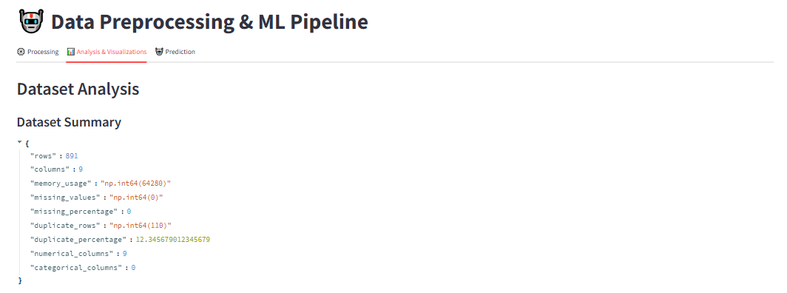
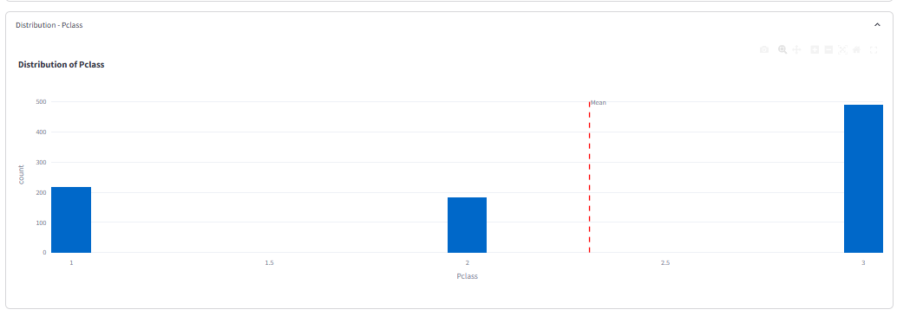
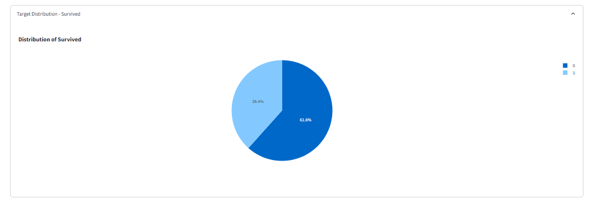
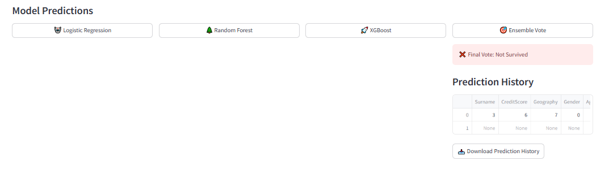

# Automatic ML Pipeline


An end-to-end machine learning pipeline application built with Streamlit that automates the entire data science workflow from preprocessing to prediction.

## 🌟 Features

### 1. Data Preprocessing
- 📊 Upload and clean your data
- 🔄 Handle missing values automatically
- 🔤 Encode categorical variables
- 🔍 Remove correlated features
- ⚖️ Balance the dataset using SMOTE
- 📈 Scale features automatically

### 2. Analysis & Visualization
- 📊 View dataset statistics
- 📈 Explore feature distributions
- 🔍 Analyze correlations
- 📉 Generate interactive visualizations
- 📊 Export analysis reports

### 3. Prediction
- 🤖 Train multiple models:
  - Logistic Regression
  - Random Forest
  - XGBoost
- 🎯 Ensemble voting
- 📊 Model performance metrics
- 📥 Download predictions
- 📊 Prediction history tracking

## 🚀 Getting Started

### Prerequisites
- Python 3.8 or higher
- pip (Python package installer)

### Installation

1. Clone the repository:
```bash
git clone https://github.com/mahmoud0nasser/Automatic-ML-Pipeline.git
cd Automatic-ML-Pipeline
```

2. Create a virtual environment (recommended):
```bash
python -m venv venv
source venv/bin/activate  # On Windows: venv\Scripts\activate
```

3. Install dependencies:
```bash
pip install -r requirements.txt
```

### Running the Application

1. Start the Streamlit app:
```bash
streamlit run app.py
```

2. Open your web browser and navigate to:
```
http://localhost:8501
```

## 📁 Project Structure

```
Automatic-ML-Pipeline/
├── app.py                  # Main Streamlit application
├── requirements.txt        # Project dependencies
├── src/
│   ├── models/
│   │   └── model_trainer.py    # Model training and evaluation
│   ├── preprocessing/
│   │   └── data_processor.py   # Data preprocessing pipeline
│   ├── utils/
│   │   ├── data_utils.py       # Data utility functions
│   │   └── model_utils.py      # Model utility functions
│   └── visualization/
│       └── data_viz.py         # Data visualization functions
├── AutoClean/             # Custom data cleaning package
│   ├── __init__.py
│   ├── autoclean.py
│   └── modules.py
└── misc/                  # Miscellaneous files
    ├── sample_data.png
    └── sample_data_output.png
```

## 🛠️ Usage

1. **Data Upload**
   - Upload your CSV file
   - Select the target column
   - View data preview

2. **Data Processing**
   - Clean data automatically
   - Handle missing values
   - Encode categorical variables
   - Remove correlated features
   - Balance the dataset
   - Scale features

3. **Analysis**
   - View dataset statistics
   - Explore feature distributions
   - Analyze correlations
   - Generate visualizations

4. **Prediction**
   - Train multiple models
   - Make predictions
   - View ensemble results
   - Download prediction history

## 📊 Application Screenshots

### Data Processing

*Upload and process your data with an intuitive interface*

### Data Analysis

*Comprehensive data analysis and visualization tools*

### Feature Engineering

*Automatic feature engineering and preprocessing*

### Model Training

*Train multiple models with automated hyperparameter tuning*

### Prediction Interface

*Make predictions with trained models*

### Ensemble Voting

*Combine predictions from multiple models*

### Results Visualization

*Visualize model performance and predictions*

### Download Results

*Export and download your results*

## 🤝 Contributing

Contributions are welcome! Please feel free to submit a Pull Request.

1. Fork the repository
2. Create your feature branch (`git checkout -b feature/AmazingFeature`)
3. Commit your changes (`git commit -m 'Add some AmazingFeature'`)
4. Push to the branch (`git push origin feature/AmazingFeature`)
5. Open a Pull Request

## 📝 License

This project is licensed under the MIT License - see the [LICENSE](LICENSE.txt) file for details.

## 👏 Acknowledgments

- [Streamlit](https://streamlit.io/) for the amazing web framework
- [Scikit-learn](https://scikit-learn.org/) for machine learning algorithms
- [XGBoost](https://xgboost.ai/) for the gradient boosting framework
- [Plotly](https://plotly.com/) for interactive visualizations

## 📧 Contact

Mahmoud Nasser - [@mahmoud0nasser](https://github.com/mahmoud0nasser)

Project Link: [https://github.com/mahmoud0nasser/Automatic-ML-Pipeline](https://github.com/mahmoud0nasser/Automatic-ML-Pipeline) 